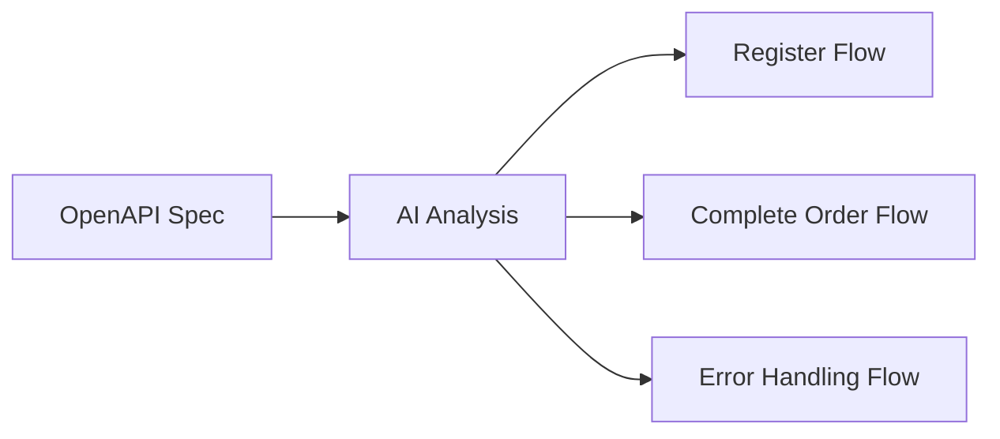
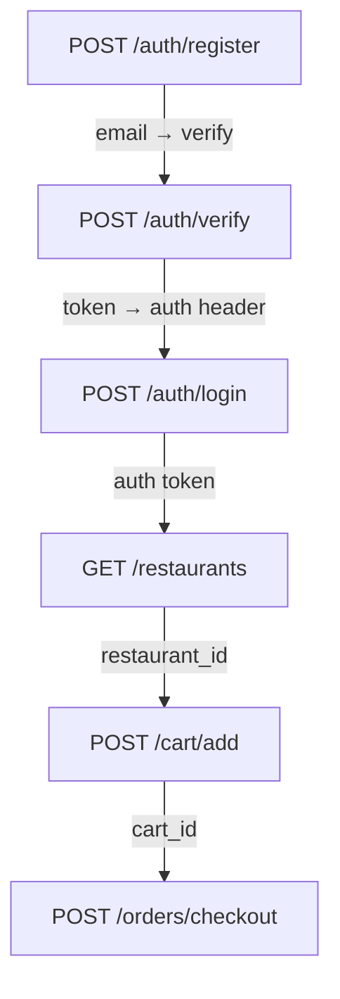
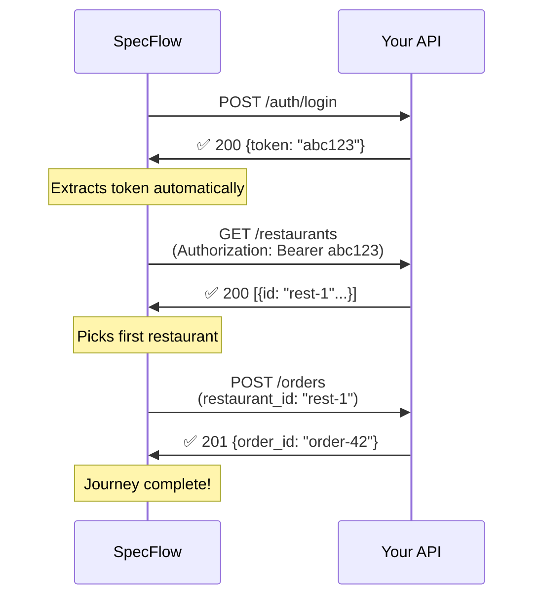

# SpecFlow

**Context-aware API testing that understands your workflows**

Transform your OpenAPI specs into interactive user journeys. Test real-world API flows in minutes, not hours.

---

## The Problem

Testing APIs today is **painfully slow**:

- ⏱️ **Hours wasted** setting up Postman collections
- 🔗 **Manual chaining** - copy token from login, paste into next request, repeat
- 🤷 **No context** - testing individual endpoints doesn't catch integration bugs
- 📝 **Tedious documentation** - keeping test scenarios in sync with API changes
- 👥 **Team friction** - backend waits for frontend, QA waits for both

**Most API testing tools treat your API like isolated endpoints. Your users don't.**

---

## The Solution

**SpecFlow automatically generates realistic user journeys from your OpenAPI spec.**

Upload your `swagger.json` → Get interactive workflows that test how your API actually works.

### What makes SpecFlow different

✨ **AI-powered journey generation** - Understands relationships between endpoints  
🎨 **Visual workflow builder** - Drag-and-drop interface, no code required  
⚡ **Instant mock data** - Auto-generates realistic test payloads  
🔄 **Smart data flow** - Passes tokens, IDs, and data between steps automatically  
🎯 **Error injection** - Test failures without breaking production  
👥 **Team collaboration** - Share test scenarios across backend, QA, and frontend  

---

## How It Works

### 1. Upload Your OpenAPI Spec
```
Drop your swagger.json or paste your API URL
SpecFlow validates and extracts all endpoints
```

### 2. AI Generates User Journeys



SpecFlow's AI identifies logical workflows:
- "New User Registration" → Register → Verify Email → Login
- "Complete Food Order" → Browse → Add to Cart → Checkout
- "Test Error Handling" → Invalid Auth → 401 Response

### 3. Visualize & Customize



**Drag to reorder. Click to edit. SpecFlow handles the complexity.**

### 4. Execute & Debug

Hit "Run Journey" and watch your API come to life:



**Every step shows:**
- Request payload (editable mock data)
- Response body
- Headers
- Timing
- Pass/fail status

---

## Use Cases

### 🧑‍💻 For Backend Developers
- Test multi-step flows in seconds
- Catch integration bugs before QA
- Share API behavior with frontend team
- Auto-update tests when spec changes

### 🧪 For QA Engineers
- No coding required
- Inject failures to test error handling
- Save and rerun regression suites
- Generate test reports automatically

### 🎨 For Frontend Developers
- See real API responses before backend is done
- Understand auth flows and data dependencies
- Test edge cases without bothering backend team
- Mock server for local development

### 👔 For Product Managers
- Visualize how features work end-to-end
- Validate user journeys before development
- Communicate flows to stakeholders
- No technical knowledge required

---

## Key Features

### 🤖 AI Journey Generation
Upload your OpenAPI spec and get intelligent workflow suggestions in seconds. SpecFlow analyzes endpoint names, parameters, and responses to infer logical user journeys.

### 🎨 Visual Workflow Builder
Drag-and-drop interface powered by Vue Flow. Reorder steps, add branches, inject errors—all without writing code.

### ⚡ Smart Mock Data
Auto-generates realistic test data based on your schemas. Email fields get valid emails, UUIDs get UUIDs, dates get dates. Edit manually or regenerate instantly.

### 🔄 Automatic Data Flow
Tokens from login flow to protected endpoints. IDs from creation flow to updates. SpecFlow maps data between steps intelligently.

### 🎯 Error Injection
Test how your API handles failures:
- Simulate timeouts
- Force specific status codes
- Modify response data
- Drop authentication headers

### 📊 Real-Time Execution
Watch your API journey execute step-by-step with live request/response display. Pause, inspect, and debug at any point.

### 👥 Team Collaboration
Share journeys with teammates. Export to Postman. Generate documentation. Keep everyone in sync.

### 🔄 Environment Management
Switch between dev, staging, and production with one click. Same journeys, different targets.

---

## Why Teams Choose SpecFlow

| Traditional Testing | SpecFlow |
|-------------------|----------|
| 10 minutes to set up Postman collection | 2 minutes from spec to working tests |
| Manually copy/paste tokens between requests | Automatic data flow between steps |
| Test isolated endpoints | Test real user workflows |
| Update tests manually when API changes | Auto-syncs with OpenAPI spec |
| Share screenshots of Postman | Share interactive, runnable journeys |

---

## Example Journey

**Testing a food delivery app:**

```
1. POST /auth/register
   ↓ (auto-extracts user_id)
   
2. POST /auth/verify-email
   ↓ (auto-extracts token)
   
3. POST /auth/login
   ↓ (token → Authorization header)
   
4. GET /restaurants?location=SF
   ↓ (picks first restaurant_id)
   
5. GET /restaurants/{id}/menu
   ↓ (picks popular menu items)
   
6. POST /cart/add-items
   ↓ (gets cart_id)
   
7. POST /orders/checkout
   ↓ (creates order)
   
8. GET /orders/{order_id}
   ✅ Verify order was created
```

**Without SpecFlow:** 30 minutes to set up, prone to errors  
**With SpecFlow:** 2 minutes, runs perfectly every time

---

## Who It's For

✅ **Backend developers** testing API integrations  
✅ **QA engineers** building regression suites  
✅ **Frontend developers** understanding API behavior  
✅ **Product managers** validating user flows  
✅ **Technical writers** documenting API workflows  
✅ **DevOps teams** monitoring API health  

**If you work with APIs, SpecFlow saves you time.**

---

## The SpecFlow Difference

Most API tools are built for developers. **SpecFlow is built for teams.**

- **Non-technical users** can create and run tests
- **Developers** get powerful customization
- **Everyone** sees the same truth about how the API works

---

## Stack

**Frontend:** Vue 3 + Vue Flow + TailwindCSS  
**Backend:** Python + FastAPI + PostgreSQL  
**AI:** Claude (Anthropic) for journey generation  
